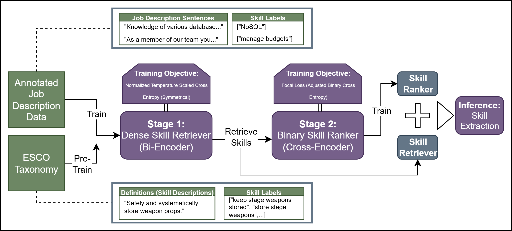

# Retrieve-and-Rank-Multi-stage-pipeline-for-Skill-Extraction
This repository contains a multi-stage pipeline for skill extraction. The pipeline includes:

- **Stage 1**: A curriculum-based **bi-encoder retriever**, trained to retrieve relevant skill candidates for job description sentences.
- **Stage 2**: A **cross-encoder ranker**, trained with a binary ranking objective to determine which of the retrieved candidates are truly relevant.

Below is a high-level overview of the proposed framework:

## Instructions on use
Below, you are provided with a complete instruction on how to use the pipeline. For the most optimal training, use a CUDA-enabled environment with access to a GPU. After downloading the repository and extracting the Dataset folder, refer to the following steps:

### Installation
After creating a virtual Python environment with CUDA 12.1. Install the required packages:
<pre> pip install -r ./requirements.txt </pre>
### Stage 1- The bi-encoder retriever
To train a bi-encoder retriever following our curriculum training strategy, simply run:
<pre> bash ./train_retriever.sh </pre>
in your terminal. This should initiate the full training for the Retriever. You can test the retriever using:
<pre> bash ./test_retriever.sh </pre>
You can also specify different training sets in this file. The performance metric will be displayed after the algorithm runs. You can access the retrieved datasets from the output repository.
### Stage 2- The cross-encoder ranker
To train the cross-encoder, you should use:
<pre> bash ./train_ranker.sh </pre>
Then, for testing use:
<pre> bash ./test_ranker.sh </pre>
### LLM ranker baseline
If you want to test an LLM ranking baseline, run:
<pre> bash ./test_llm.sh </pre>
Here, you need to make sure to provide a designated OpenAI API key. 

We redistribute all the training and test data to ensure a smoother implementation. However, if you wish to use original data sources, refer to:
- [DECORTE](https://huggingface.co/datasets/TechWolf/Synthetic-ESCO-skill-sentences)
- [HOUSE](https://huggingface.co/datasets/TechWolf/skill-extraction-house)
- [TECH](https://huggingface.co/datasets/TechWolf/skill-extraction-tech)
- [TECHWOLF](https://huggingface.co/datasets/TechWolf/skill-extraction-techwolf)
- [SKILLSKAPE](https://github.com/magantoine/JobSkape/tree/main)

We thank the original authors for making these datasets publicly available. Please remember to cite them appropriately in any work using these resources.
